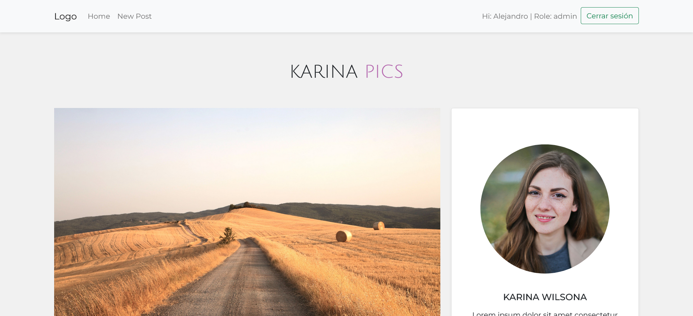
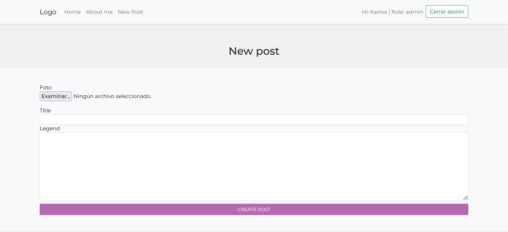
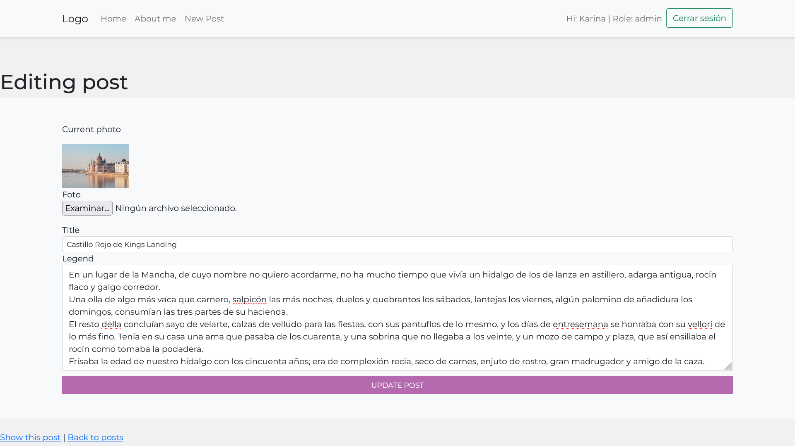
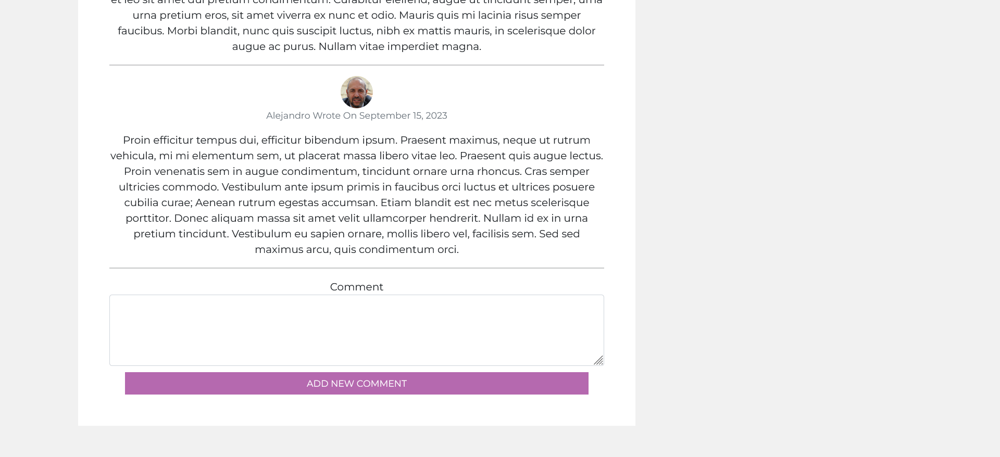

 

# Proyecto KariPics : Blog para registro de fotos y comentarios.

_Blog sobre fotos y comentarios de visitantes_

## Comenzando 🚀

Este proyecto utiliza las gemas:

devise
active_storage
annotate

Para descargar (clonar) este repositorio debes ejecutar en tu cónsola:

```hash
git clone https://github.com/apinango70/KariPics-2.0
```

## Sobre el proyecto:

El sistema permite la creación:

 

edición:

 

y porder comentar los posts del blog.

 

__NOTA__: Solo el usuario con el rol admin puede crear, editar o borrar los posts. Los visitantes podrán acceder al index y a los posts, para poder dejar algún comentario el visitante se debe registrar en el sistema.

## Pendiente por hacer:

- Que el admin pueda borrar algún comentario.

### Pre-requisitos 📋

Para ejecutar este proyecto, debes tener instalado ruby

```hash
https://rubyinstaller.org/
```

Instalar la gema Bundler

```hash
gem install bundler
```

Instalar la gema rails

```hash
gem install rails
```

Instalar postgresql

```hash
https://www.postgresql.org/
```

Instalar las gemas devise, annotate y faker

```hash
bundle add devise annotate faker
```

### Instalación 🔧

Para mostrar localmente este proyecto, debes garantizar que todas las dependencias de gemas estén configuradas correctamente, para eso debes ejecutar:

Se debe crear la base de datos y correr la migración ejecutando:

```hash
rails db:create
rails db:migrate
```

Una vez que se han actualizado todas las gemas, creado la base de datos y generado los datos de prueba, se debe montar el servidor ejecutando:

```hash
rails s
```

En el navegador debes ir a la página:

```hash
localhost:3000/
```

Para poder usar el blog, debes tener creado un user admin, para hacer esto se debe crear un usuario que tendrá por defecto rol "normal", para cambiar a admin se debe hacer por la consola de rails.

```hash
rails c
```

y ejecutar:

```hash
user = User.find_by(email: 'karina@mail.com')
user.update(role: 'admin')
user.save
```

__NOTA:__ se debe cambiar __user@mail.com__ por el correo que se utilizó para registrar al user que se desea cambiar a admin. 

Verificar si se realizó el cambio:

```hash
User.last
```

## Despliegue 📦

Para hacer un deploy en Heroku, debes seguir los siguientes pasos en la cónsola:

* Logearse en heroku

```hash
heroku login
```

* Crear la app en heroku

```hash
heroku create
```

* Subimos los cambios a heroku

```hash
git push heroku main
```

* Ejecutar git a  remote

```hash
git remote
```

* Ejecutar bundle para tener el proyecto actualizado hasta ese momento

```hash
bundle install
```

* Hacer un commit antes de subir la app a heroku

```hash
git add .
```

```hash
git commit -m "Mensaje del commit"
```

* Corremos las migraciones para el correcto funcionamiento

```hash
heroku run rake db:migrate
```

* Corremos el seed para tener datos

```hash
heroku run rake db:seed
```

## Construido con 🛠️

Para el desarrollo de este proyecto se utilizaron las sigientes heramientas

* [Ruby 3.2.2](https://www.ruby-lang.org/es/)
* [Rails 7.0.6](https://rubyonrails.org/)
* [Bootstrap 5.3](https://getbootstrap.com/docs/5.3/getting-started/download/)
* [Postgresql 14.8](https://www.postgresql.org/)
* [Frontend tomado de:](https://github.com/irimaya/067-minimalistic-blog)

## Contribuyendo 🖇️

Por favor siéntete libre de enviar pull requests y hacer forks.

## Autores ✒️

* **Alejandro Piñango** - Trabajo Inicial y Documentación - [apinango](https://github.com/apinango70)

## Licencia 📄

Este proyecto está bajo la Licencia (MIT) - mira el archivo [LICENSE.md](LICENSE.md) para detalles

---

Hecho con ❤️ por [apinango70](https://github.com/apinango70) 😊
